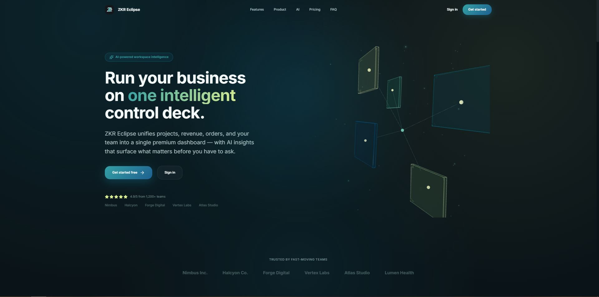
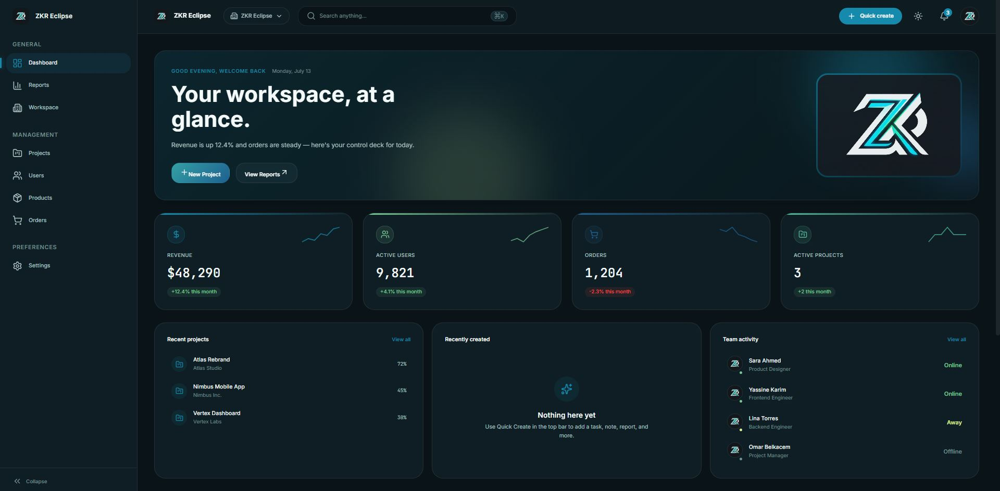
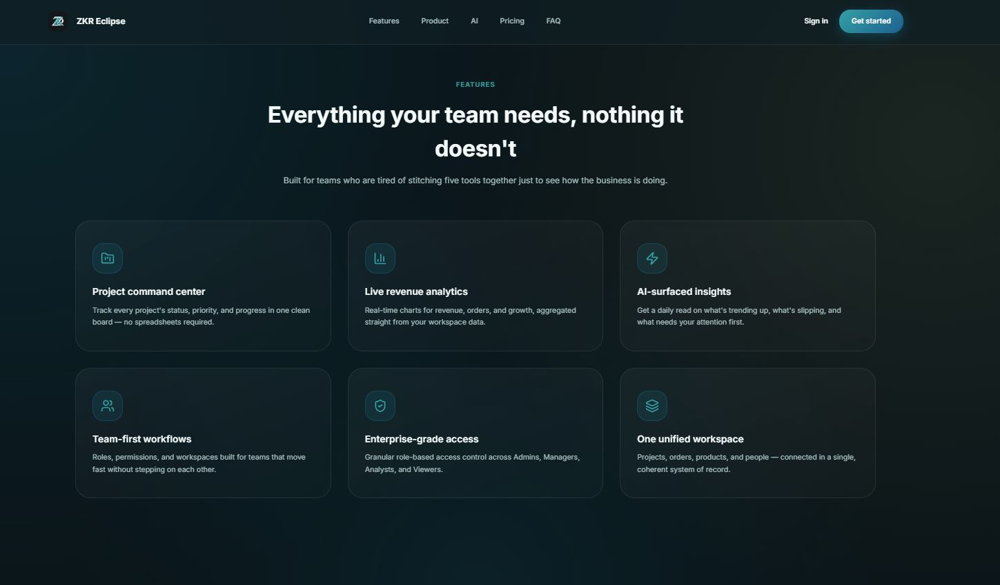
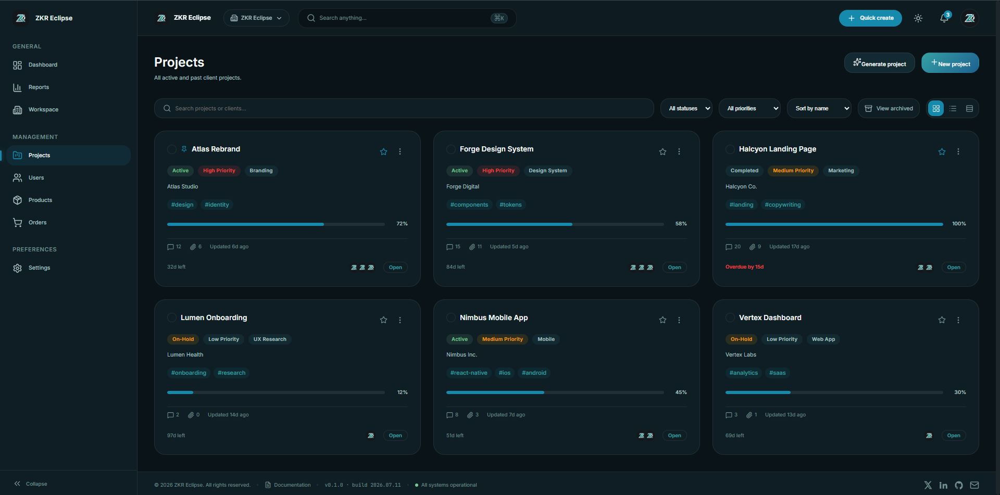
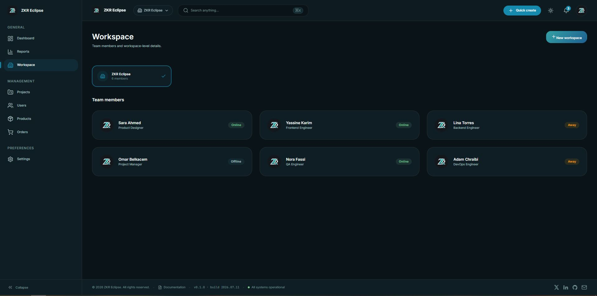
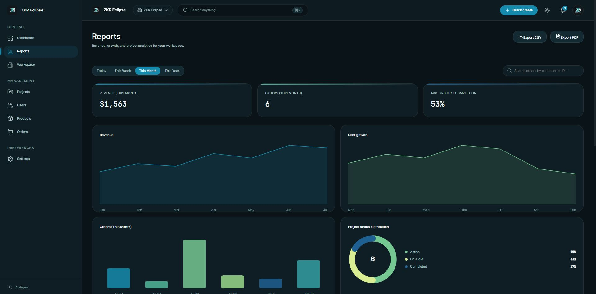
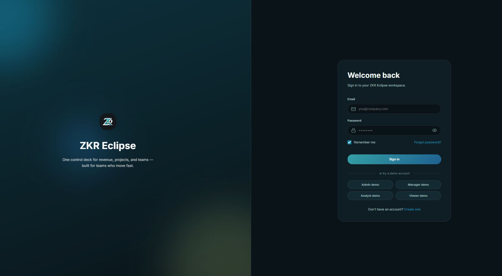

# ZKR Eclipse

<p align="center">
  
</p>

<p align="center">
  A premium SaaS dashboard platform built with React, TypeScript, and Vite.
</p>

<p align="center">
  A scalable dashboard experience featuring a custom design system, workspace management, analytics, reusable components, and automation-ready interfaces.
</p>

---

# Built With

<p align="center">


<br/>


</p>

---

# Screenshots

<p align="center">
  
  
</p>

<p align="center">
  
  
</p>

<p align="center">
  
  
</p>

<p align="center">
  
  
</p>

<p align="center">
  
</p>

---

# About The Project

ZKR Eclipse is a modern SaaS dashboard application designed to provide a complete management interface for projects, workspaces, users, products, orders, and business analytics.

The project focuses on delivering a premium user experience through:

* Scalable frontend architecture
* Reusable component system
* Centralized design tokens
* Responsive layouts
* Modern dashboard patterns

The platform provides a professional foundation for SaaS products, internal tools, and business management applications.

---

# Features

## Dashboard

* Analytics overview
* Data visualization
* Statistics cards
* Interactive tables
* Business metrics interface

## Workspace Management

* Project organization
* Workspace views
* User management
* Product management
* Order management

## Component Library

Reusable UI components including:

* Buttons
* Cards
* Modals
* Dropdown menus
* Toast notifications
* Tables
* Charts
* Forms
* Layout components

## Design System

A token-based design system managing:

* Colors
* Typography
* Spacing
* Border radius
* Shadows
* Animations

All components use shared CSS variables to maintain consistency throughout the application.

## Automation Interface

The application includes an automation-focused interface designed for future AI-powered workflows and intelligent dashboard features.

---

# Tech Stack

## Frontend

| Technology | Purpose                       |
| ---------- | ----------------------------- |
| React      | UI library                    |
| TypeScript | Type-safe development         |
| Vite       | Development and build tooling |
| CSS        | Styling architecture          |

## Architecture

| Technology             | Purpose                  |
| ---------------------- | ------------------------ |
| React Context          | Global providers         |
| Custom Hooks           | Shared application logic |
| Component Architecture | Reusable UI system       |
| CSS Variables          | Design tokens            |

---

# Architecture Overview

The application follows a modular frontend architecture:

```text
Application Layer
        |
        |
Pages and Routing
        |
        |
Reusable Components
        |
        |
Context Providers and Hooks
        |
        |
Design System Tokens
```

This structure improves:

* Scalability
* Maintainability
* Development speed
* Code organization

---

# Project Structure

```text
ZKR-Eclipse/

├── public/
│   └── zkr.jpg
│
├── screens/
│   ├── AI automation.JPG
│   ├── dashboard.JPG
│   ├── Features.JPG
│   ├── Live preview.JPG
│   ├── login.JPG
│   ├── Projects.JPG
│   ├── Reports.JPG
│   ├── Home.JPG
│   └── Workspace.JPG
│
├── src/
│   ├── components/
│   │   └── Reusable UI components
│   │
│   ├── context/
│   │   └── React context providers
│   │
│   ├── data/
│   │   └── Mock data
│   │
│   ├── hooks/
│   │   └── Custom hooks
│   │
│   ├── pages/
│   │   └── Application pages
│   │
│   ├── router/
│   │   └── Route configuration
│   │
│   ├── store/
│   │   └── Application state
│   │
│   └── styles/
│       └── Global styles and design tokens
│
└── package.json
```

---

# Installation

Clone the repository:

```bash
git clone <YOUR_REPOSITORY_URL>

cd ZKR-Eclipse

npm install
```

---

# Running Locally

Start the development server:

```bash
npm run dev
```

Application:

```text
http://localhost:5173
```

---

# Available Scripts

| Command         | Description              |
| --------------- | ------------------------ |
| npm run dev     | Start development server |
| npm run build   | Build production version |
| npm run preview | Preview production build |
| npm run lint    | Run ESLint               |

---

# Design System

Design tokens are located at:

```text
src/styles/tokens.css
```

The system controls:

* Brand colors
* Typography
* Layout spacing
* Component radius
* Shadows
* Motion behavior

Updating the tokens automatically updates the entire interface.

---

# Main Pages

* Login
* Home Dashboard
* Analytics Dashboard
* Projects
* Workspace
* Reports
* Features
* AI Automation
* Live Preview

---

# Performance And Quality

The project follows modern frontend practices:

* Type-safe development
* Component-based architecture
* Reusable UI patterns
* Optimized build process
* Clean folder organization
* Scalable structure

---

# Future Improvements

Planned improvements:

* Backend integration
* Authentication system
* Real-time notifications
* Advanced analytics
* AI workflow automation
* Multi-tenant SaaS support
* Cloud deployment

---

# Production Build

Create a production build:

```bash
npm run build
```

Preview:

```bash
npm run preview
```

---

# Contributing

Contributions are welcome.

Steps:

1. Fork the repository
2. Create a feature branch
3. Commit your changes
4. Push your branch
5. Open a pull request

---

# License

MIT License

---

# Contact

## Zakariaa Adli

GitHub
https://github.com/zr7791474-blip

X (Twitter)
https://x.com/zkr_ad

WhatsApp
https://wa.me/212657516301

Email
[zr7791474@gmail.com](mailto:zr7791474@gmail.com)
